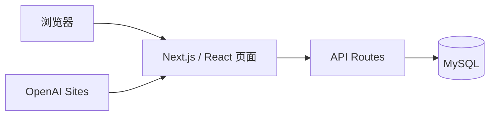

# 系统架构

## 总览

浏览器通过 Next/vinext 页面访问应用。客户端界面调用同源 `/api/*` 路由，API 使用 `mysql2` 连接在线 MySQL。生产构建运行在 OpenAI Sites 的 Cloudflare Workers 环境中。

## 页面与路由

一级页面由 `app/[view]/page.tsx` 承载，二级页面由 `app/[view]/[subview]/page.tsx` 承载。当前核心路由包括学习、词库、复习及管理；复习与管理的子页面均保留独立 URL。

界面和交互主要集中在 `app/KotobaApp.tsx`，全局响应式样式位于 `app/globals.css`。通知使用公共组件 `app/components/Notifications.tsx`。

## API

| 路径 | 主要用途 |
|---|---|
| `/api/categories`、`/api/categories/:id` | 类别查询、新增、修改 |
| `/api/vocabulary`、`/api/vocabulary/:id` | 词汇分页查询和增删改 |
| `/api/progress` | 学习、掌握和错题进度 |
| `/api/favorite-groups` | 收藏组和默认收藏组 |
| `/api/favorites` | 收藏与取消收藏 |
| `/api/articles` | 文章和项目文档 |

## 身份与数据隔离

生产环境优先从托管平台注入的用户邮箱请求头识别用户；学习进度和收藏通过用户标识隔离。数据库凭据仅由运行环境的 `DATABASE_URL` 提供。

