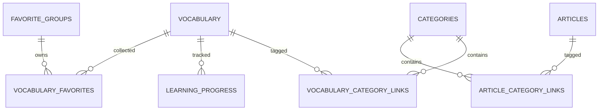

# 数据库设计

数据库使用 MySQL。业务关联使用数值 ID 和关联表，不依赖类别名称等可变文本。数据库当前共有八张业务表，所有字段均应具有 MySQL `COMMENT`。

## 表用途

| 表 | 用途 |
|---|---|
| `vocabulary` | 日语词汇、假名、翻译等主体数据 |
| `categories` | 可复用的类别或标签，支持停用 |
| `vocabulary_category_links` | 词汇与类别的多对多关联 |
| `learning_progress` | 用户对词汇的学习、掌握和错误状态 |
| `favorite_groups` | 用户收藏组、名称、备注和默认组 |
| `vocabulary_favorites` | 词汇与收藏组的收藏关系 |
| `articles` | 文章、固定知识和项目文档 |
| `article_category_links` | 文章与类别的多对多关联 |

## 关系

## 变更规则

- 新字段必须同时定义类型、空值规则、默认值、索引和 `COMMENT`。
- 外键或逻辑关联统一使用 ID。
- 类别不允许物理删除；需要隐藏时更新启用状态。
- 结构调整应以可重复执行的迁移 SQL 保存，并同步更新本文件和管理页“项目文档”。
- 连接串只保存在本地 `.env` 或托管环境变量中，不进入 Git。

线上数据库的完整 `SHOW CREATE TABLE` SQL 在管理页面的“项目文档”中维护，以确保展示内容与实际数据库同步。

