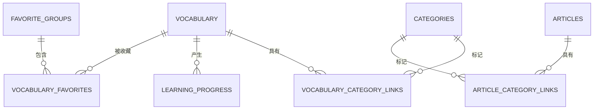

# 数据库结构

> 本文是数据库结构的唯一仓库文档，集中维护表用途、字段、索引、外键和关系。业务需求参见《项目需求文档》，连接和调用方式参见《前后端技术架构》。

## 1. 设计原则

- 使用 MySQL 8。
- 业务关联使用数值 ID，不以名称作为外键。
- 词汇与类别、文章与类别均为多对多关系。
- 当前个人站点的学习进度、收藏组和收藏关系统一使用站点所有者 `user_key`；现值为 `site-owner`。
- 类别不物理删除，通过 `enabled` 停用。
- 每个字段必须具有 MySQL `COMMENT`。
- 结构变化必须同步迁移 SQL、本文件和网站相关文档。
- 真实连接串只存在于 `.env` 或托管环境变量。

## 2. 表总览

| 表 | 用途 |
|---|---|
| `vocabulary` | 词汇、假名、翻译、词性和熟悉度 |
| `categories` | 词汇与文章共用的类别/标签配置 |
| `vocabulary_category_links` | 词汇与类别的多对多关系 |
| `learning_progress` | 用户对词汇的当前状态和累计答题次数 |
| `favorite_groups` | 用户收藏组、备注和默认状态 |
| `vocabulary_favorites` | 用户、收藏组与词汇的关系 |
| `articles` | BJT 等日语知识文章 |
| `article_category_links` | 文章与类别的多对多关系 |

## 3. 实体关系



关系说明：

1. `vocabulary` 与 `categories` 通过 `vocabulary_category_links` 多对多关联。
2. `articles` 与 `categories` 通过 `article_category_links` 多对多关联。
3. `learning_progress` 使用 `user_key + vocabulary_id` 保存用户词汇状态。
4. `favorite_groups` 属于用户，`vocabulary_favorites` 连接用户、收藏组和词汇。
5. 删除词汇时，其进度、分类关联和收藏关联级联删除。
6. 删除收藏组时只级联删除组内收藏关系，不删除词汇。

## 4. 完整建表结构

以下结构来自当前在线 MySQL 的 `SHOW CREATE TABLE`。当前连接启用了 ANSI 引号模式，因此标识符显示为双引号。

### 4.1 vocabulary

```sql
CREATE TABLE "vocabulary" (
  "id" bigint unsigned NOT NULL AUTO_INCREMENT COMMENT '词汇唯一ID',
  "word" varchar(255) CHARACTER SET utf8mb4 COLLATE utf8mb4_unicode_ci NOT NULL COMMENT '日语词汇、固定搭配或完整句子',
  "reading" varchar(255) CHARACTER SET utf8mb4 COLLATE utf8mb4_unicode_ci DEFAULT NULL COMMENT '假名读音；固定搭配或完整句子可为空',
  "meaning" text CHARACTER SET utf8mb4 COLLATE utf8mb4_unicode_ci NOT NULL COMMENT '中文释义',
  "part_of_speech" varchar(50) CHARACTER SET utf8mb4 COLLATE utf8mb4_unicode_ci NOT NULL DEFAULT '' COMMENT '词性或条目类型',
  "familiarity" varchar(40) CHARACTER SET utf8mb4 COLLATE utf8mb4_unicode_ci NOT NULL DEFAULT '' COMMENT '熟悉程度或原始数据标记',
  "created_at" timestamp NOT NULL DEFAULT CURRENT_TIMESTAMP COMMENT '创建时间',
  "updated_at" timestamp NOT NULL DEFAULT CURRENT_TIMESTAMP ON UPDATE CURRENT_TIMESTAMP COMMENT '最后更新时间',
  PRIMARY KEY ("id"),
  KEY "vocabulary_word_idx" ("word")
);
```

### 4.2 categories

```sql
CREATE TABLE "categories" (
  "id" bigint unsigned NOT NULL AUTO_INCREMENT COMMENT '类别唯一ID',
  "name" varchar(100) CHARACTER SET utf8mb4 COLLATE utf8mb4_unicode_ci NOT NULL COMMENT '类别名称',
  "scope" enum('vocabulary','article','both') CHARACTER SET utf8mb4 COLLATE utf8mb4_unicode_ci NOT NULL DEFAULT 'vocabulary' COMMENT '适用对象：词汇、文章或两者',
  "purpose" enum('study','topic','development') CHARACTER SET utf8mb4 COLLATE utf8mb4_unicode_ci NOT NULL DEFAULT 'study' COMMENT '用途：学习分类、内容主题或开发文档',
  "sort_order" int unsigned NOT NULL DEFAULT '0' COMMENT '显示排序值',
  "enabled" tinyint(1) NOT NULL DEFAULT '1' COMMENT '是否启用：1启用，0停用',
  "created_at" timestamp NOT NULL DEFAULT CURRENT_TIMESTAMP COMMENT '创建时间',
  "updated_at" timestamp NOT NULL DEFAULT CURRENT_TIMESTAMP ON UPDATE CURRENT_TIMESTAMP COMMENT '最后更新时间',
  PRIMARY KEY ("id"),
  UNIQUE KEY "categories_name_unique" ("name")
);
```

`scope` 控制类别用于词汇、文章或两者；`purpose` 区分学习分类、内容主题和开发文档。

### 4.3 vocabulary_category_links

```sql
CREATE TABLE "vocabulary_category_links" (
  "vocabulary_id" bigint unsigned NOT NULL COMMENT '关联 vocabulary.id',
  "category_id" bigint unsigned NOT NULL COMMENT '关联 categories.id',
  "sort_order" int unsigned NOT NULL COMMENT '词汇在该类别内的来源顺序',
  "source_file" varchar(255) CHARACTER SET utf8mb4 COLLATE utf8mb4_unicode_ci DEFAULT NULL COMMENT '词汇来源文件名',
  "source_line" int unsigned DEFAULT NULL COMMENT '词汇在来源文件中的行号',
  "created_at" timestamp NOT NULL DEFAULT CURRENT_TIMESTAMP COMMENT '关联创建时间',
  PRIMARY KEY ("vocabulary_id","category_id"),
  KEY "vocabulary_category_links_category_idx" ("category_id"),
  CONSTRAINT "vocabulary_category_links_category_fk" FOREIGN KEY ("category_id") REFERENCES "categories" ("id"),
  CONSTRAINT "vocabulary_category_links_vocabulary_fk" FOREIGN KEY ("vocabulary_id") REFERENCES "vocabulary" ("id") ON DELETE CASCADE
);
```

复合主键防止一个词汇重复关联同一类别；`sort_order` 独立保存每个类别的来源顺序，因此同一词汇可以在 BJT 与 N1 中处于不同位置。

### 4.4 learning_progress

```sql
CREATE TABLE "learning_progress" (
  "user_key" varchar(191) CHARACTER SET utf8mb4 COLLATE utf8mb4_unicode_ci NOT NULL COMMENT '用户唯一标识',
  "vocabulary_id" bigint unsigned NOT NULL COMMENT '词汇ID',
  "status" enum('pending','mastered','error') CHARACTER SET utf8mb4 COLLATE utf8mb4_unicode_ci NOT NULL DEFAULT 'pending' COMMENT '学习状态：待学习、已掌握或错题',
  "correct_count" int unsigned NOT NULL DEFAULT '0' COMMENT '累计答对次数',
  "wrong_count" int unsigned NOT NULL DEFAULT '0' COMMENT '累计答错次数',
  "updated_at" timestamp NOT NULL DEFAULT CURRENT_TIMESTAMP ON UPDATE CURRENT_TIMESTAMP COMMENT '最后学习时间',
  PRIMARY KEY ("user_key","vocabulary_id"),
  KEY "progress_status_idx" ("user_key","status"),
  KEY "progress_vocabulary_fk" ("vocabulary_id"),
  CONSTRAINT "progress_vocabulary_fk" FOREIGN KEY ("vocabulary_id") REFERENCES "vocabulary" ("id") ON DELETE CASCADE
);
```

复合主键确保每位用户对每个词汇只有一条当前状态。

### 4.5 favorite_groups

```sql
CREATE TABLE "favorite_groups" (
  "id" bigint unsigned NOT NULL AUTO_INCREMENT COMMENT '收藏组唯一ID',
  "user_key" varchar(191) CHARACTER SET utf8mb4 COLLATE utf8mb4_unicode_ci NOT NULL COMMENT '用户唯一标识',
  "name" varchar(100) CHARACTER SET utf8mb4 COLLATE utf8mb4_unicode_ci NOT NULL COMMENT '收藏组名称',
  "note" varchar(500) CHARACTER SET utf8mb4 COLLATE utf8mb4_unicode_ci NOT NULL DEFAULT '' COMMENT '收藏组备注',
  "is_default" tinyint(1) NOT NULL DEFAULT '0' COMMENT '是否为默认收藏组：1是，0否',
  "created_at" timestamp NOT NULL DEFAULT CURRENT_TIMESTAMP COMMENT '创建时间',
  "updated_at" timestamp NOT NULL DEFAULT CURRENT_TIMESTAMP ON UPDATE CURRENT_TIMESTAMP COMMENT '最后更新时间',
  PRIMARY KEY ("id"),
  UNIQUE KEY "favorite_groups_user_name_unique" ("user_key","name"),
  KEY "favorite_groups_user_default_idx" ("user_key","is_default")
);
```

同一用户不能创建重名收藏组。默认组唯一性当前由事务保证，索引用于按用户查找默认组。

### 4.6 vocabulary_favorites

```sql
CREATE TABLE "vocabulary_favorites" (
  "user_key" varchar(191) CHARACTER SET utf8mb4 COLLATE utf8mb4_unicode_ci NOT NULL COMMENT '用户唯一标识',
  "group_id" bigint unsigned NOT NULL COMMENT '收藏组ID',
  "vocabulary_id" bigint unsigned NOT NULL COMMENT '词汇ID',
  "created_at" timestamp NOT NULL DEFAULT CURRENT_TIMESTAMP COMMENT '收藏时间',
  PRIMARY KEY ("user_key","group_id","vocabulary_id"),
  KEY "vocabulary_favorites_vocabulary_idx" ("vocabulary_id"),
  KEY "vocabulary_favorites_group_idx" ("group_id"),
  CONSTRAINT "vocabulary_favorites_group_fk" FOREIGN KEY ("group_id") REFERENCES "favorite_groups" ("id") ON DELETE CASCADE,
  CONSTRAINT "vocabulary_favorites_vocabulary_fk" FOREIGN KEY ("vocabulary_id") REFERENCES "vocabulary" ("id") ON DELETE CASCADE
);
```

复合主键允许同一词汇进入多个收藏组，但不能在同一组内重复收藏。

### 4.7 articles

```sql
CREATE TABLE "articles" (
  "id" bigint unsigned NOT NULL AUTO_INCREMENT COMMENT '文章唯一ID',
  "title" varchar(255) CHARACTER SET utf8mb4 COLLATE utf8mb4_unicode_ci NOT NULL COMMENT '文章标题',
  "content" longtext CHARACTER SET utf8mb4 COLLATE utf8mb4_unicode_ci NOT NULL COMMENT 'Markdown格式文章正文',
  "sort_order" int unsigned NOT NULL DEFAULT '0' COMMENT '显示排序值',
  "created_at" timestamp NOT NULL DEFAULT CURRENT_TIMESTAMP COMMENT '创建时间',
  "updated_at" timestamp NOT NULL DEFAULT CURRENT_TIMESTAMP ON UPDATE CURRENT_TIMESTAMP COMMENT '最后更新时间',
  PRIMARY KEY ("id"),
  UNIQUE KEY "articles_title_unique" ("title")
);
```

普通知识文章和项目需求文档共用此表，通过类别用途区分。

### 4.8 article_category_links

```sql
CREATE TABLE "article_category_links" (
  "article_id" bigint unsigned NOT NULL COMMENT '文章ID',
  "category_id" bigint unsigned NOT NULL COMMENT '类别ID',
  "created_at" timestamp NOT NULL DEFAULT CURRENT_TIMESTAMP COMMENT '关联创建时间',
  PRIMARY KEY ("article_id","category_id"),
  KEY "article_category_links_category_idx" ("category_id"),
  CONSTRAINT "article_category_links_article_fk" FOREIGN KEY ("article_id") REFERENCES "articles" ("id") ON DELETE CASCADE,
  CONSTRAINT "article_category_links_category_fk" FOREIGN KEY ("category_id") REFERENCES "categories" ("id")
);
```

复合主键防止一篇文章重复关联同一类别。

## 5. 维护和迁移规则

数据库结构变化时必须同时完成：

1. 编写并执行可审查的迁移 SQL。
2. 为新增或修改字段补充准确 `COMMENT`。
3. 更新本文件的表用途、SQL 和关系说明。
4. 检查 API 查询、事务和类型定义。
5. 更新受影响的业务需求或技术架构文档。
6. 构建并验证相关读写流程。

不得把生产或测试数据库密码、完整连接串、备份文件中的密钥提交到 Git。
